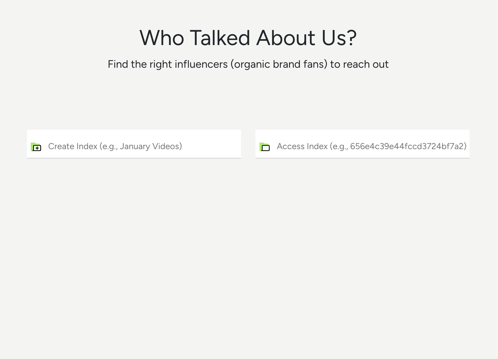

## 👋 Introduction

"Who Talked About Us?" is an influencer-filtering app where a user can:

1. Create an index (a library of videos)
2. Upload YouTube videos in bulk by (public) playlist ID, channel ID, or JSON file
3. Filter the videos and channels that mention a provided keyword (e.g., _applying MAC gold highlighter_)
4. View specific timelines or references of videos mentioning the keyword

This application utilizes [Twelve Labs API](https://docs.twelvelabs.io/docs) for the rich, contextual video search. Twelve Labs is an AI-powered video understanding platform that extracts various types of information from videos, such as movement and actions, objects and people, sound, text on screen, and speech.

  

### Built With

- [JavaScript](https://developer.mozilla.org/en-US/docs/Web/JavaScript)
- [Node](https://nodejs.org/en)
- [React](https://react.dev/)
- [React Query](https://tanstack.com/query/latest)
- [React Bootstrap](https://react-bootstrap.netlify.app/)
- [ytdl-core](https://www.npmjs.com/package/ytdl-core)
- [ytpl](https://www.npmjs.com/package/ytpl)
- [React Player](https://www.npmjs.com/package/react-player)