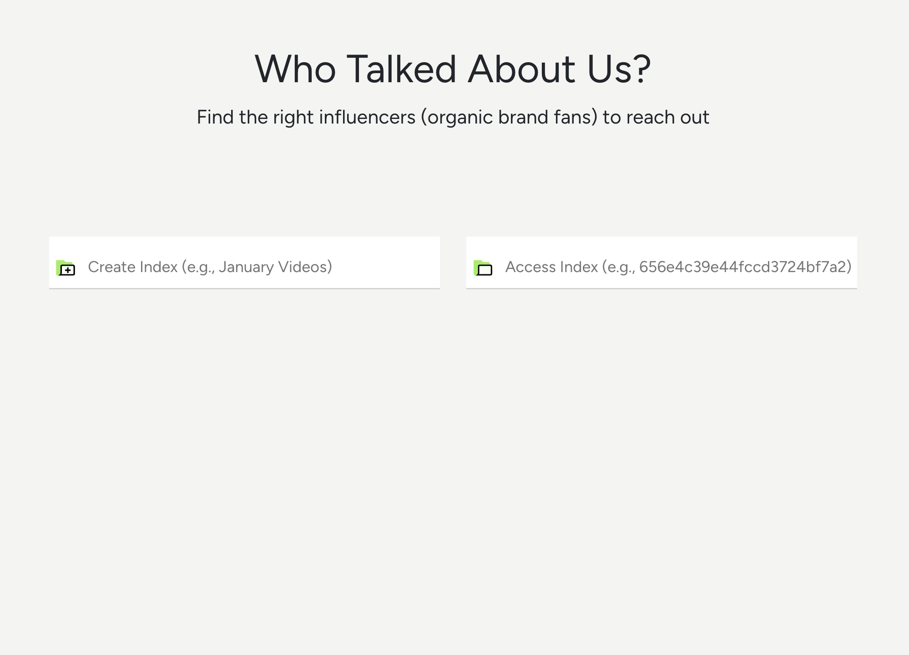

<a id="readme-top"></a>

# Who Talked About Us?

## 👋 Introduction

"Who Talked About Us?" is an influencer-filtering app where a user can:

1. Create an index (a library of videos)
2. Upload YouTube videos in bulk by (public) playlist ID, channel ID, or JSON file
3. Filter the videos and channels that mention a provided keyword (e.g., _applying MAC gold highlighter_)
4. View specific timelines or references of videos mentioning the keyword

This application utilizes [Twelve Labs API](https://docs.twelvelabs.io/docs) for the rich, contextual video search. Twelve Labs is an AI-powered video understanding platform that extracts various types of information from videos, such as movement and actions, objects and people, sound, text on screen, and speech.

  

### Built With

- [JavaScript](https://developer.mozilla.org/en-US/docs/Web/JavaScript)
- [Node](https://nodejs.org/en)
- [React](https://react.dev/)
- [React Query](https://tanstack.com/query/latest)
- [React Bootstrap](https://react-bootstrap.netlify.app/)
- [ytdl-core](https://www.npmjs.com/package/ytdl-core)
- [ytpl](https://www.npmjs.com/package/ytpl)
- [React Player](https://www.npmjs.com/package/react-player)

<p align="right">(<a href="#readme-top">back to top</a>)</p>

## ✨ What is it for?

In my years of experience in influencer partnerships within the beauty industry, a crucial lesson has emerged: the most successful collaborations often arise organically with influencers who genuinely embrace your brand or products. Identifying these influencers can be challenging, especially when your brand isn't explicitly mentioned in video titles or descriptions. This has been a personal pain point, such as when a YouTuber features your product in a video without explicitly naming your brand, making it hard to discover through conventional searches.

That's where the Who Talked About Us with Twelve Labs API can be a game-changer. Unlike traditional YouTube or TikTok searches, this API enables deep contextual video searches by extracting various elements from videos, including movements, objects, people, sounds, on-screen text, and speech. By inputting keywords or specific descriptions, such as "_applying MAC gold highlighter_," you can uncover videos discussing your brand or products with precise moments of reference. This innovative approach empowers you to build a targeted list of influencers, complete with details about the products they've mentioned and the context, providing valuable insights for more effective engagement and meaningful connections.


In the search results (see the image above), you can effortlessly identify videos by Jean Watts, Allure, and Ssin that mention "_MAC gold highlighter_," along with the exact moments of reference. In contrast, the videos from Hindash, Risabae, and Vogue did not feature such mentions. Armed with this comprehensive result, you can strategically prioritize reaching out to influencers like Jean, Allure, and Ssin, armed with the right context for more impactful collaborations.

## 🚘 How to Use

1. Either create a new index or provide an index of one of your existing indexes. You can look up the index ids by [listing indexes](https://docs.twelvelabs.io/v1.2/reference/list-indexes).

2. Once you are inside an index, Begin by uploading videos in bulk to the app using either YouTube [playlist ID](https://www.sociablekit.com/find-youtube-playlist-id/#:~:text=Go%20to%20your%20target%20YouTube,playlist%20ID%20is%20PLFs4vir_WsTwEd%2DnJgVJCZPNL3HALHHpF), [channel ID](https://mixedanalytics.com/blog/find-a-youtube-channel-id/), or JSON file.

   - A YouTube playlist and channel should be public
   - The format of a JSON file should follow below structure

     ```
     [
      { "url": "<VIDEO URL>" },
      { "url": "<VIDEO URL>" }
      ...
     ]
     ```

3. Once the videos are uploaded, you can conduct a search using any keyword. Here are some suggestions:

   - Enter your brand name or product name and discover who's already talking about you in their videos
   - Enter your competitors' brand names to see what types of influencers they're attracting
   - You can also search for very specific or contextual keywords such as "_applying MAC gold highlighter_" or "_holding Gentle Monster sunglasses_"!

4. The search results will be shown grouped by each channel (influencer) and video, displaying moments in videos where your keyword is mentioned or featured.

5. Based on these results, you can prioritize influencers and begin your outreach efforts, forging partnerships that can expand your brand reach and influence. Remember, success in influencer marketing is all about forming authentic partnerships!

<p align="right">(<a href="#readme-top">back to top</a>)</p>

## 🔑 Getting Started

### Step 1. Generate API Key and Create .env File

1. Visit [Twelve Labs Playground](https://playground.twelvelabs.io/) to generate your API Key
   - Once you sign up, you'll receive complimentary credits allowing you to index up to 10 hours of video content!
2. Create `.env` file in the root directory and update the values for each key

   ```
    .env

    REACT_APP_API_URL=https://api.twelvelabs.io/v1.1
    REACT_APP_API_KEY=<YOUR API KEY>
    REACT_APP_SERVER_URL=<YOUR SERVER URL>
    REACT_APP_PORT_NUMBER=<YOUR PORT NUMBER>

   ```

   - You can simply copy-paste the above and customize the values
   - `REACT_APP_API_URL`: This app supports v1.1
   - `REACT_APP_API_KEY`: Store the API Key that you generated in the previous step
   - `REACT_APP_SERVER_URL`: It could be something like "http://localhost"
   - `REACT_APP_PORT_NUMBER`: Set a port number you want to use (e.g., 4001)

### Step 2. Start the App

1. Clone the current repo
   ```sh
   git clone git@github.com:mrnkim/Who-Talked-About-Us.git
   ```
2. Start the server

   ```sh
   nodemon server.js
   ```

3. Install and start the client

   ```sh
   npm install
   npm start
   ```

<p align="right">(<a href="#readme-top">back to top</a>)</p>

## 🎯 What is Next?

- Add more tests (or automate testing)
- Improve error handling and add data validations

