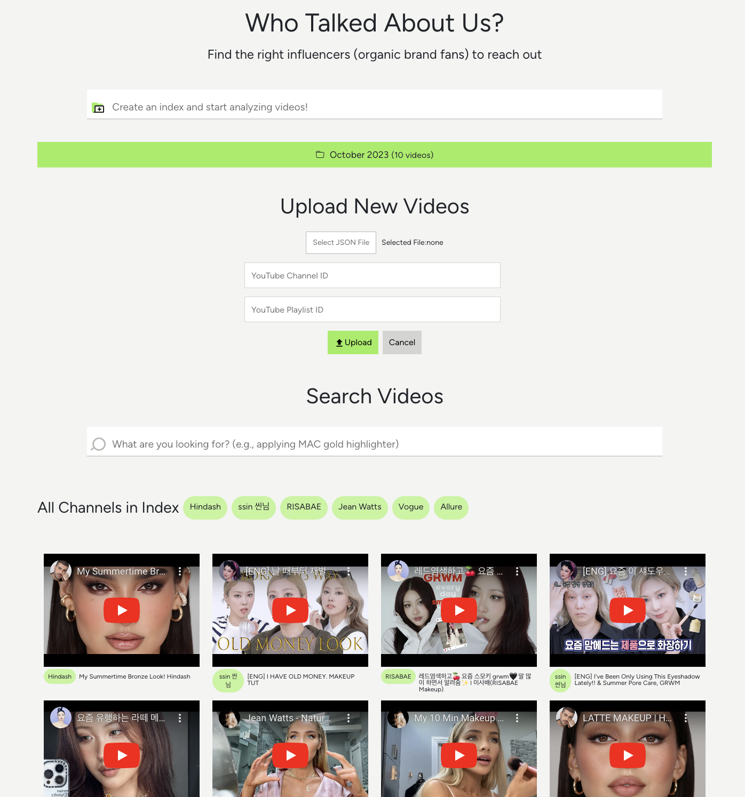
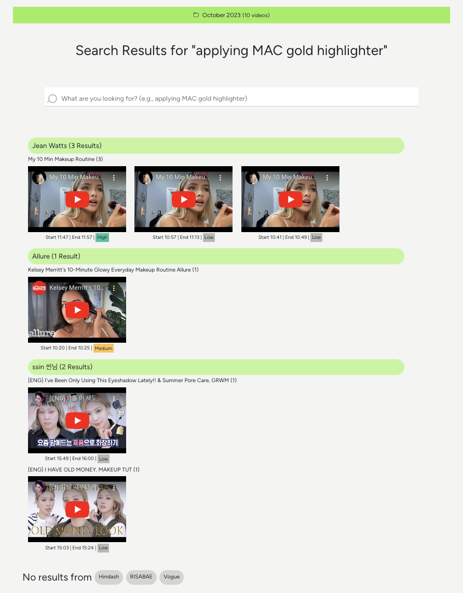

<a id="readme-top"></a>

# Who Talked About Us?

## 👋 Introduction

"Who Talked About Us?" is an influencer-searching app where a user can:

- Create an index (a library of videos)
- Upload videos by YouTube (public) playlist ID, channel ID, or JSON file
- Search specific timelines of videos by a keyword (e.g., applying MAC gold highlighter)
- See the search result by channel to easily capture who mentioned the keyword and who did not

This application utilizes [Twelve Labs API](https://docs.twelvelabs.io/docs) for the rich, contextual video search. Twelve Labs is an AI-powered video understanding platform that extracts various types of information from videos, such as movement and actions, objects and people, sound, text on screen, and speech.

<div style="border: 1px solid black;">
  
</div>

### Built With

- [JavaScript](https://developer.mozilla.org/en-US/docs/Web/JavaScript)
- [Node](https://nodejs.org/en)
- [React](https://react.dev/)
- [React Bootstrap](https://react-bootstrap.netlify.app/)
- [ytdl-core](https://www.npmjs.com/package/ytdl-core)
- [ytpl](https://www.npmjs.com/package/ytpl)
- [React Player](https://www.npmjs.com/package/react-player)

<p align="right">(<a href="#readme-top">back to top</a>)</p>

## ✨ What is it for?

> 💡 Social media & influencer marketing for a brand

Discovering the right YouTube or TikTok influencer for your brand is crucial. The most effective influencer partnerships typically evolve organically, with influencers who already use or discuss your products or brand. However, pinpointing these influencers can be challenging, especially as YouTube and TikTok searches often miss content where your brand name isn't explicitly mentioned in video titles or descriptions.

This is where the User-Generated Content (UGC) Analyzer can provide immense value. Unlike standard YouTube or TikTok searches, this app enables in-depth, contextual video searching. By inputting a simple keyword (e.g., _your brand name_) or specific descriptions (e.g., "applying _your product name_"), you can identify videos that discuss or feature your brand or products, pinpointing the exact moments these references occur.

<div style="border: 1px solid black;">

</div>

Follow this simple guide on how to use the UGC Analyzer:

1. Begin by uploading videos to the app using either YouTube [playlist ID](https://www.sociablekit.com/find-youtube-playlist-id/#:~:text=Go%20to%20your%20target%20YouTube,playlist%20ID%20is%20PLFs4vir_WsTwEd%2DnJgVJCZPNL3HALHHpF), [channel ID](https://mixedanalytics.com/blog/find-a-youtube-channel-id/), or JSON file.

   - A YouTube playlist and channel should be public
   - JSON file format should be

     ```javascript
     [
      { "url": "(video url)" },
      { "url": "(video url)" }
      ...
     ]
     ```

2. Once the videos are uploaded, you can conduct a search using any keyword. Here are some suggestions:

   - Enter your brand name or product name and discover who's already talking about you in their videos
   - Enter your competitors' brand names to see what types of influencers they're attracting and the types of audiences they're reaching
   - You can also search for very specific or contextual keywords such as "_applying MAC gold highlighter_" or "_holding blue sunglasses_"!

3. The search results will be shown grouped by each channel (influencer) and video, displaying moments in videos where your keyword is mentioned or featured.

4. Based on these results, you can prioritize influencers and begin your outreach efforts, forging partnerships that can expand your brand reach and influence

Remember, success in influencer marketing is all about forming authentic partnerships!

<p align="right">(<a href="#readme-top">back to top</a>)</p>

## 🔑 Getting Started

### Step 1. Generate API Key & Create Videos Folder

1. Visit [Twelve Labs Playground](https://playground.twelvelabs.io/) to generate your API Key
   - Once you sign up, you'll receive complimentary credits allowing you to index up to 10 hours of video content!
2. Check the current API Base URL at [Twelve Labs API Reference](https://docs.twelvelabs.io/reference/api-reference) and update the version as needed
3. Create .env file and store/update the values of API_KEY and API_URL

   ```

   .env

   REACT_APP_API_URL=https://api.twelvelabs.io/p/v1.1
   REACT_APP_API_KEY=YOUR_API_KEY

   ```

4. Create a folder named `videos` in the root directory. All the videos will be downloaded and saved to this folder.

### Step 2. Start the App

1. Clone the current repo
   ```sh
   git clone git@github.com:mrnkim/vid-analyzer-react.git
   ```
2. Start the server

   ```sh
   nodemon server.js
   ```

3. Install and start the client

   ```sh
   npm install
   npm start
   ```

<p align="right">(<a href="#readme-top">back to top</a>)</p>

## 📚 Using Twelve Labs API

The core API calls and functions live in `src/videos/UploadYouTubeVideo.jsx` and `server.js`. In this tutorial, I'd like to highlight two parts; downloading & indexing videos and updating meta data of a video.

### 1. Downloading and Indexing Videos

Once a user provides either a YouTube channel ID, YouTube playlist ID, or JSON file, the videos will be downloaded to `videos` folder in .mp4 format. Then the downloaded videos will be submitted for indexing in Twelve Labs API. Below is the code snippet of the relevant part from `server.js`.

> 💡 Check out details at [Create an Index](https://docs.twelvelabs.io/reference/create-index) in Twelve Labs API Reference

```javascript
server.js;

/** Download and index videos for analysis, returning task IDs and index ID */
app.post(
  "/download",
  bodyParser.urlencoded(),
  async (request, response, next) => {
    console.log("🚀 > request=", request);

    try {
      // Step 1: Extract video data and index information from the request
      const jsonVideos = request.body.videoData;
      const indexName = request.body.indexName;
      const totalVideos = jsonVideos.length;
      let processedVideosCount = 0;
      const chunk_size = 5;
      let videoIndexingResponses = [];
      console.log("Downloading Videos...");

      // Step 2: Download videos in chunks
      for (let i = 0; i < totalVideos; i += chunk_size) {
        const videoChunk = jsonVideos.slice(i, i + chunk_size);
        const chunkDownloadedVideos = [];

        // Download each video in the current chunk.
        await Promise.all(
          videoChunk.map(async (videoData) => {
            try {
              // Generate a safe file name for the downloaded video
              const safeName = sanitize(videoData.title);
              const videoPath = `videos/${safeName}.mp4`;

              // Download the video from the provided URL
              const stream = ytdl(videoData.url, {
                filter: "videoandaudio",
                format: ".mp4",
              });
              await streamPipeline(stream, fs.createWriteStream(videoPath));

              console.log(`${videoPath} -- finished downloading`);
              chunkDownloadedVideos.push(videoPath);
            } catch (error) {
              console.log(`Error downloading ${videoData.title}`);
              console.error(error);
            }
          })
        );

        // Step 3: Submit downloaded videos for indexing
        console.log(
          `Submitting Videos For Indexing | Chunk ${
            Math.floor(i / chunk_size) + 1
          }`
        );

        const chunkVideoIndexingResponses = await Promise.all(
          chunkDownloadedVideos.map(async (video) => {
            console.log(`Submitting ${video} For Indexing...`);
            return await indexVideo(video, request.body.indexName._id);
          })
        ).catch(next);

        // Log indexing completion and update progress
        console.log("Indexing Submission Completed for Chunk | Task IDs:");

        processedVideosCount += videoChunk.length;
        console.log(
          `Processed ${processedVideosCount} out of ${totalVideos} videos`
        );
        videoIndexingResponses = videoIndexingResponses.concat(
          chunkVideoIndexingResponses
        );

        await new Promise((resolve) => setTimeout(resolve, 1000));
      }

      // Step 4: Respond with task IDs for the indexing tasks and the index ID
      console.log(
        "Indexing Submission For All Videos Completed With Task IDs:"
      );
      console.log(videoIndexingResponses);

      response.json({
        taskIds: videoIndexingResponses,
        indexId: request.body.indexName._id,
      });
    } catch (error) {
      next(error);
    }
  }
);
```

### 2. Updating the metadata of a video

Once all videos are indexed, `updateMetadata` runs to customize each video's metadata by adding `"author"` and `"youtubeUrl"` to the default metatdata. This way, the author (channel) names are properly shown in frontend and each React Player component renders videos by YouTube (or video) urls.

> 💡 Check out details at [Provide custom metadata](https://docs.twelvelabs.io/docs/provide-custom-metadata) in Twelve Labs API Reference

```javascript
/** Add "author" and "youtubeUrl" meta data to each video **/
async function updateMetadata() {
  if (indexedVideos) {
    const updatePromises = indexedVideos.map(async (indexedVid) => {
      const matchingVid = taskVideos?.find(
        (taskVid) => taskVid.metadata.filename === indexedVid.metadata.filename
      );

      if (matchingVid) {
        const authorName = matchingVid.author.name;
        const youtubeUrl = matchingVid.video_url || matchingVid.shortUrl;
        const TWELVE_LABS_API_KEY = process.env.REACT_APP_API_KEY;
        const VIDEO_URL = `${process.env.REACT_APP_API_URL}/indexes/${currIndex}/videos/${indexedVid._id}`;

        //include custom data to add to the existing metadata
        const data = {
          metadata: {
            author: authorName,
            youtubeUrl: youtubeUrl,
          },
        };

        const options = {
          method: "PUT",
          url: VIDEO_URL,
          headers: {
            "Content-Type": "application/json",
            "x-api-key": TWELVE_LABS_API_KEY,
          },
          data: data,
        };

        try {
          const response = await axios.request(options);
          console.log("Response from API:", response.status);
        } catch (error) {
          console.error("Error updating metadata:", error);
        }
      }
    });

    // Wait for all metadata updates to complete
    await Promise.all(updatePromises);

    // Now that all updates are done, trigger the page reload
    window.location.reload();
  }
}
```

## 🎯 What is Next?

Below is the to-do list for the current version of the app. Feel free to make suggestions!

- Add more tests (or automate)
- Improve error handling and add data validations
- Allow a user to customize index/search options
- Combine `api.js` and `server.js` to reduce redundancy

  [app-screenshot]: public/app.png
  [search-screenshot]: public/searchResult.png
  [component-design]: public/component%20Design_UGC.png
