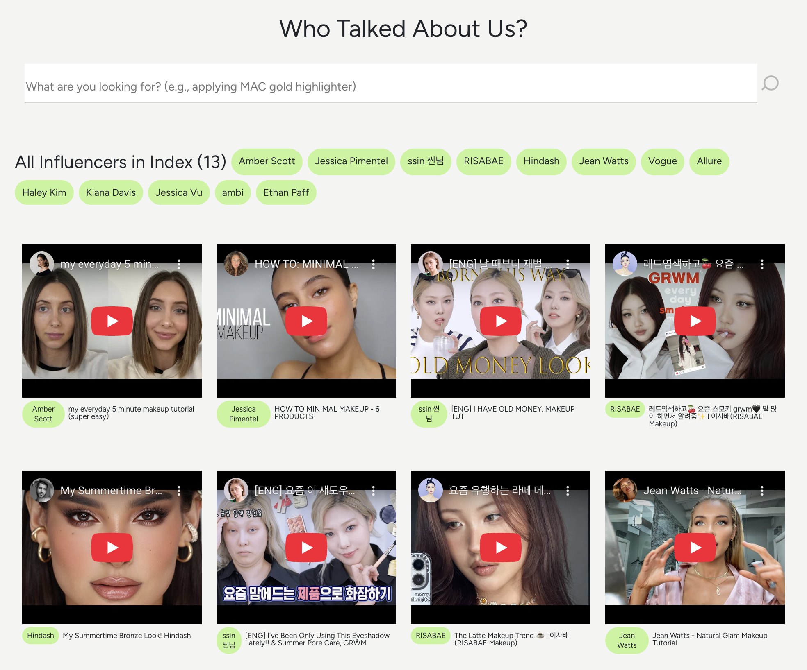

<a id="readme-top"></a>

# Who Talked About Us?

## 👋 Introduction

"Who Talked About Us?" is an influencer-filtering app where a user can:

1. Create an index (a library of videos)
2. Upload YouTube videos in bulk by (public) playlist ID, channel ID, or JSON file
3. Filter the videos and channels that mention a provided keyword (e.g., _applying MAC gold highlighter_)
4. View specific timelines or references of videos mentioning the keyword

This application utilizes [Twelve Labs API](https://docs.twelvelabs.io/docs) for the rich, contextual video search. Twelve Labs is an AI-powered video understanding platform that extracts various types of information from videos, such as movement and actions, objects and people, sound, text on screen, and speech.

📌 Check out the [Demo](https://who-talked-about-us-vercel-v2-deplo-one.vercel.app/)! (Please note: This is a simplified version of the app)

  

### Built With

- [JavaScript](https://developer.mozilla.org/en-US/docs/Web/JavaScript)
- [Node](https://nodejs.org/en)
- [React](https://react.dev/)
- [React Query](https://tanstack.com/query/latest)
- [React Bootstrap](https://react-bootstrap.netlify.app/)
- [ytdl-core](https://www.npmjs.com/package/ytdl-core)
- [ytpl](https://www.npmjs.com/package/ytpl)
- [React Player](https://www.npmjs.com/package/react-player)

<p align="right">(<a href="#readme-top">back to top</a>)</p>

## ✨ What is it for?

After years in beauty influencer marketing (now turned software engineer 😉), one thing is clear: the best partnerships come from creators who genuinely love your brand. But finding them is tough—especially when your brand isn't mentioned in video titles or descriptions. I’ve struggled with this myself when a YouTuber featured a product but never named it explicitly.

That’s where Who Talked About Us, powered by Twelve Labs API, changes the game. It searches inside video content—detecting visuals, speech, and on-screen text—so you can find exact moments like “applying MAC gold highlighter.”


Take this example: the search reveals that Jean Watts, Risabae, Glamzilla, and Smitha Deepak did mention the product, while 18 others didn’t. With this context, you can confidently prioritize outreach to the right creators for more meaningful collaborations.

## 🚘 How to Use

1. Please create a new index or enter the index ID of a video you uploaded through _this app_. (❗️Only videos indexed _via this app_ are supported)

2. Once you are inside an index, Begin by uploading videos in bulk to the app using either YouTube [playlist ID](https://www.sociablekit.com/find-youtube-playlist-id/#:~:text=Go%20to%20your%20target%20YouTube,playlist%20ID%20is%20PLFs4vir_WsTwEd%2DnJgVJCZPNL3HALHHpF), [channel ID](https://mixedanalytics.com/blog/find-a-youtube-channel-id/), or JSON file.

   - A YouTube playlist and channel should be public
   - The format of a JSON file should follow below structure

     ```
     [
      { "url": "<VIDEO URL>" },
      { "url": "<VIDEO URL>" }
      ...
     ]
     ```

3. Once the videos are uploaded, you can conduct a search using any keyword. Here are some suggestions:

   - Enter your brand name or product name and discover who's already talking about you in their videos
   - Enter your competitors' brand names to see what types of influencers they're attracting
   - You can also search for very specific or contextual keywords such as "_applying MAC gold highlighter_" or "_holding Gentle Monster sunglasses_"!

4. The search results will be shown grouped by each channel (influencer) and video, displaying moments in videos where your keyword is mentioned or featured.

5. Based on these results, you can prioritize influencers and begin your outreach efforts, forging partnerships that can expand your brand reach and influence. Remember, success in influencer marketing is all about forming authentic partnerships!

<p align="right">(<a href="#readme-top">back to top</a>)</p>

## 🔑 Getting Started

### Step 1. Generate Twelve Labs API Key

Visit [Twelve Labs Playground](https://playground.twelvelabs.io/) to generate your API Key. Once you sign up, you'll receive complimentary credits allowing you to index up to 10 hours of video content!

### Step 2. Start the App Locally

1. Clone the current repo

   ```sh
   git clone git@github.com:mrnkim/Who-Talked-About-Us.git
   ```

2. Create `.env` file in the root directory and update the values for each key

   ```
    .env

    REACT_APP_API_KEY=<YOUR API KEY>
    REACT_APP_PORT_NUMBER=<YOUR PORT NUMBER> // Optional (set to 4000 by default)
   ```

3. Install dependencies

   ```sh
   npm install
   ```

4. Start the server

   ```sh
   node server.js
   ```

5. Start the client (in a separate terminal)

   ```sh
   npm start
   ```

   <p align="right">(<a href="#readme-top">back to top</a>)</p>
